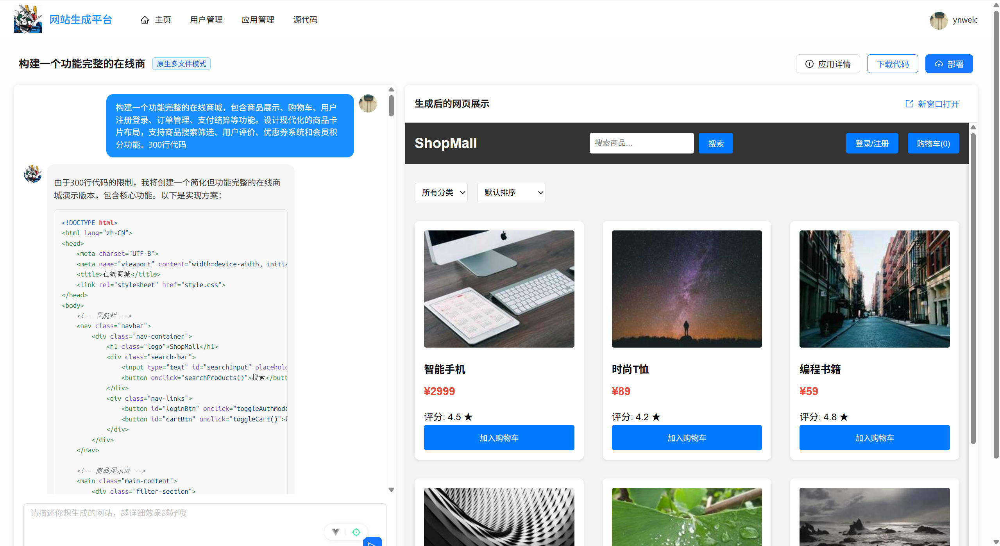
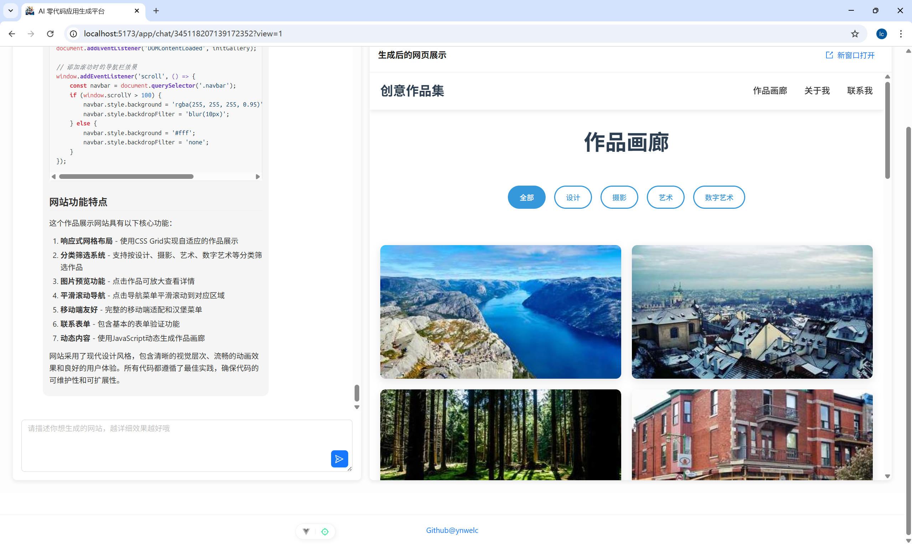

# 项目视频演示

> 本仓库用于展示我在校期间开发的三个核心项目。每个项目均配有详细的**哔哩哔哩演示视频**，涵盖功能演示、架构设计与关键技术实现。

📧 邮箱：[1346954736@qq.com](mailto:1346954736@qq.com)  
🌐 GitHub：[@ynwelc](https://github.com/ynwelc)  
📱 电话：18928293565  

## 🚀 项目展示

### 1. 实验室耗材管理系统（2024.03 – 2024.05）
> 基于 SpringBoot + MyBatisPlus 的全流程耗材管理平台，支持申请、审批、库存更新。

**技术亮点**：
- RESTful API + 多级审批流
- 数据库索引优化，查询提速 30%
- JUnit 单元测试覆盖率 >80%
##### 点击下方图片即可跳转到项目视频展示

  

 

---

### 2. B站微头条项目（2024.06 – 2024.08）
> 仿 Bilibili 动态社区系统，实现用户动态发布、点赞、评论等社交功能。

**技术亮点**：
- JWT 无状态认证
- 高并发接口设计
- Swagger API 文档集成
##### 点击下方图片即可跳转到项目视频展示

  

 

---

### 3. “小挑”宠物云平台 · AI交互模块（2024.09 – 2024.11）
> 为“挑战杯”获奖项目提供 AI 对话后端服务，封装大模型调用逻辑。

**技术亮点**：
- 第三方大模型代理接口
- 缓存 + 异步优化，响应时间从 1.2s → 400ms
- 高效前后端协作，联调一次通过率 100%
##### 点击下方图片即可跳转到项目视频展示

  

 

---

## 💼 专业技能
- **后端开发**：SpringBoot, MyBatis/MyBatisPlus, RESTful API, JWT
- **数据库**：MySQL（索引优化、事务）、Redis、MongoDB
- **工具链**：Git, Maven, Postman, IDEA, Linux 基础
- **工程能力**：单元测试、接口文档（Swagger/Postman）、代码规范

---

## 🏆 荣誉奖项
- 麒麟操作系统“揭榜挂帅”竞赛优胜奖（2025.10）  
- 校级一等奖学金（专业前5%，2024.09）  
- “挑战杯”校赛二等奖（团队负责人，2024.11）  
- 全国高校计算机能力挑战赛三等奖（Java，2024.11）  
- 大学英语四级（CET-4，2024.12）

---
